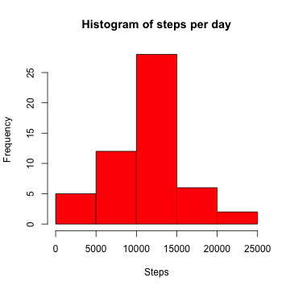
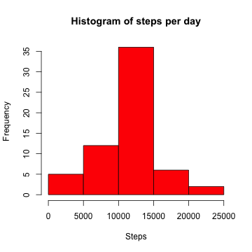
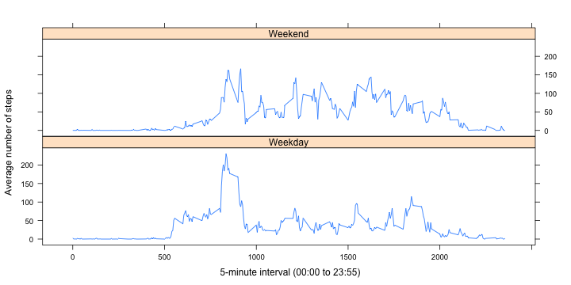

# Reproducible Research: Peer Assessment 1
========================================================
This assignment makes use of data from a personal activity monitoring device. This device collects data at 5 minute intervals through out the day. The data consists of two months of data from an anonymous individual collected during the months of October and November, 2012 and include the number of steps taken in 5 minute intervals each day.

## Loading and preprocessing the data

**Loading the data and transform the data into a format suitable for analysis**


```r
## install.packages("Defaults")   if required 
library(Defaults)

## Set the default date format to match date in the file 
setDefaults('as.Date.character', format = '%Y-%m-%d')

## set working directory
setwd("~/Desktop/ReproducibleResearch/Project_1")

## read the file, set column types
activityDF <- data.frame(read.csv("activity.csv", 
                         colClasses = c("numeric","Date","integer") ) )

##Inspect the data frame
str(activityDF)
```

```
## 'data.frame':	17568 obs. of  3 variables:
##  $ steps   : num  NA NA NA NA NA NA NA NA NA NA ...
##  $ date    : Date, format: "2012-10-01" "2012-10-01" ...
##  $ interval: int  0 5 10 15 20 25 30 35 40 45 ...
```


## What is mean total number of steps taken per day?

Ignoring the missing step values in the dataset.

A dataset containing; total (sum) number of steps taken per day

```r
sumOfStepsPerDay <- aggregate(steps ~ date, activityDF
                              , FUN = "sum", na.rm = TRUE)
```

**Histogram of the total number of steps taken each day**


```r
hist(sumOfStepsPerDay$steps, col = "red", xlab = "Steps",
     main = "Histogram of steps per day")
```

 

**The mean and the median of number of steps taken per day**


```r
mean(sumOfStepsPerDay$steps, na.rm = TRUE)
```

```
## [1] 10766
```

```r
median(sumOfStepsPerDay$steps, na.rm = TRUE)
```

```
## [1] 10765
```

## What is the average daily activity pattern?

A dataset containing; mean of steps taken per time interval

```r
meanOfStepsPerInterval <- aggregate(steps ~ interval, activityDF
                                    , FUN = "mean", na.rm = TRUE)
```

**A time series plot of the (x-axis) 5-minute interval and (y-axis) the average number of steps taken (averaged across all days)**
 

```r
plot(meanOfStepsPerInterval$interval , meanOfStepsPerInterval$steps
    , type = "l", axes = FALSE
    , ylab = "Average number of steps", xlab = "5-Minute Interval (2 Hours)")
## add axis
axis(side = 1, at = c(0,155,355,555,755,955,1155,1355,1555,1755, 1955,2155,2355))
axis(side = 2, at = seq(0, 250, by = 50), las=2)
```

 


```r
## maximum number of steps per interval
maxNumOfSteps <- max(meanOfStepsPerInterval$steps)
maxNumOfSteps
```

```
## [1] 206.2
```

**The 5-minute interval, on average across all the days in the dataset, containing the maximum number of steps.**


```r
## the 5-minute interval of the above max steps
subset(meanOfStepsPerInterval$interval, 
       meanOfStepsPerInterval$steps == maxNumOfSteps )
```

```
## [1] 835
```


## Imputing missing values

A number of days/intervals are missing step values (coded as NA). The presence of missing days may introduce bias into some calculations or summaries of the data.

Total number of missing step values in the dataset (i.e. the total number of rows with NA steps)


```r
sum(is.na(activityDF$steps))
```

```
## [1] 2304
```

**Strategy of filling in all of the missing steps values (coded as NA) with the mean step value for that 5-minute interval is used.**

To the original dataset, a new column "filledSteps" is added and populated with original step value. Then all steps with NA value is replaced with the mean step value for that 5-minute interval.


```r
activityDF$filledSteps <- activityDF$steps

## loop thru all records
for (r in 1:nrow(activityDF) ) {
    ## if steps is NA replace step value of 5-minute interval mean
    if (is.na(activityDF$steps[r])) {
         intervalIndex <- which(meanOfStepsPerInterval$interval == activityDF$interval[r])
         activityDF$filledSteps[r] =meanOfStepsPerInterval$steps[intervalIndex]
    }
}
```


A dataset containing; total (sum) number of filled steps taken per day

```r
sumOfFilledStepsPerDay <- aggregate( filledSteps ~ date
                                     , activityDF, FUN = "sum" )
```

**A histogram of the total number of steps taken each day after missing values were imputed.**


```r
hist(sumOfFilledStepsPerDay$filledSteps, col="red",xlab="Steps"
     , main="Histogram of steps per day")
```

 

The mean and the median of number of steps taken per day after missing values were imputed.


```r
mean(sumOfFilledStepsPerDay$filledSteps)
```

```
## [1] 10766
```

```r
median(sumOfFilledStepsPerDay$filledSteps)
```

```
## [1] 10766
```

These values do not differ from the estimates from the first part of the assignment.
There is no impact of imputing missing data on the estimates of the total daily number of steps.

## Are there differences in activity patterns between weekdays and weekends?

A new factor with two levels – “weekday” and “weekend” indicating whether a given date is a weekday or weekend day is added to the dataset.


```r
vectorWeekend <- c("Saturday","Sunday")

# column with day of the week
activityDF$day <- weekdays(activityDF$date) 

# catargioze the day as weekday or weekend
activityDF$week <- ifelse ( activityDF$day %in%  vectorWeekend, "Weekend"
                            , "Weekday" )

activityDF$week <- as.factor(activityDF$week )
```


```r
##Inspect the data frame
str(activityDF)
```

```
## 'data.frame':	17568 obs. of  6 variables:
##  $ steps      : num  NA NA NA NA NA NA NA NA NA NA ...
##  $ date       : Date, format: "2012-10-01" "2012-10-01" ...
##  $ interval   : int  0 5 10 15 20 25 30 35 40 45 ...
##  $ filledSteps: num  1.717 0.3396 0.1321 0.1509 0.0755 ...
##  $ day        : chr  "Monday" "Monday" "Monday" "Monday" ...
##  $ week       : Factor w/ 2 levels "Weekday","Weekend": 1 1 1 1 1 1 1 1 1 1 ...
```


A new dataset containing 5-minute interval and the average number of steps taken, averaged across all weekday days or weekend days. 


```r
meanOfStepsPerIntervalByWeek <- aggregate(activityDF$filledSteps
                             , by = list(activityDF$week, activityDF$interval)
                             , mean )
## add column names
names(meanOfStepsPerIntervalByWeek) <- c("week","interval","steps")
```

**The panel plot containing a time series plot (type = "l") of the interval (x-axis) and the average number of steps taken, averaged across all weekday days or weekend days (y-axis).** 


```r
library(lattice)

xyplot( meanOfStepsPerIntervalByWeek$steps ~ meanOfStepsPerIntervalByWeek$interval
      | meanOfStepsPerIntervalByWeek$week 
      , layout = c(1,2) ,  type = "l"
      , xlab = " 5-minute interval (00:00 to 23:55)"
      , ylab = "Average number of steps" )
```

 
